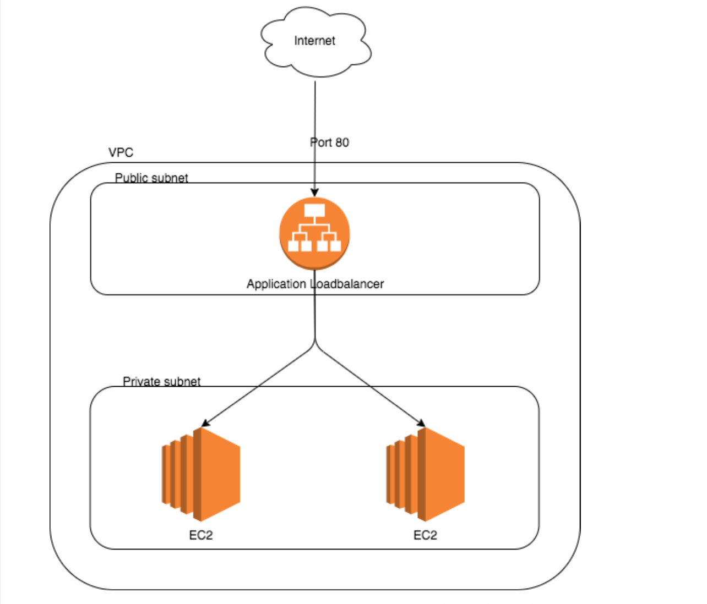

# Yan Naing Lin Tech-assigement
### aws-terraform
#### Diagram for this assigement


1. Before apply the terraform config to aws, need to authenticate from aws-cli with aws acess key. Output will be similar below.
    ```
    ➜  aws-terraform-v1 aws configure
    AWS Access Key ID [****************RJGD]:xxxxxxxxxxxxxxxxx
    AWS Secret Access Key [****************uQ7P]: xxxxxxxxxxxxxxxx
    Default region name [ap-southeast-1]: 
    Default output format [json]: 
    ```

2. To create above resources with teraform use below commands
    1. Init the config
        ```
        terraform init
        ```
    2. Plan the config
        ```
        terraform plan
        ```
    3. Apply the confg
        ```
        terraform apply
        ```
3. Need internet gateway access for first time setup in app instances since they are existing at private subnet.

4. After got the internet access on app instances run [web-install.sh](./web-install.sh).

5. Remove back the default route from private subnet route table and ssh allow rule from private security group.

6. After terraform all steps finished, can access with ***aws application loadbalancer's DNS Name*** and traffic will be going through **round robin** to app0 and app1 instances.


